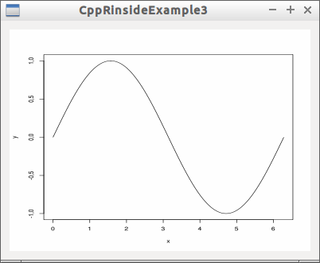

# RinsideExample3
Rinside example 3



## CppRinsideExample3.pro

```
include(../../DesktopApplication.pri)
include(../../Libraries/Rinside.pri)

HEADERS = \
  qtdialog.h

SOURCES = \
  main.cpp \
  qtdialog.cpp

FORMS += \
  qtdialog.ui
```


## main.cpp

```c++
#include <QApplication>
#include "qtdialog.h"

int main(int argc, char *argv[])
{
  QApplication app(argc, argv);
  QtDialog d;
  d.show();
  return app.exec();
}
```

## qtdialog.h

```c++
#ifndef QTDIALOG_H
#define QTDIALOG_H

#include <QDialog>

namespace Ui {
  class QtDialog;
}

struct QSvgWidget;
struct RInside;

class QtDialog : public QDialog
{
  Q_OBJECT

public:
  explicit QtDialog(QWidget *parent = 0);
  QtDialog(const QtDialog&) = delete;
  QtDialog& operator=(const QtDialog&) = delete;
  ~QtDialog();

private:
  Ui::QtDialog *ui;
  RInside * const m_r_inside;
  QSvgWidget * const m_svg_widget;

};

#endif // QTDIALOG_H
```

## qtdialog.cpp

```c++
#include "qtdialog.h"
#include <cassert>

#include <QFile>
#include <QGridLayout>
#include <QSvgWidget>
#include <QTextStream>

#include "RInside.h"
#include "ui_qtdialog.h"

QtDialog::QtDialog(QWidget *parent) :
  QDialog(parent),
  ui(new Ui::QtDialog),
  m_r_inside{new RInside},
  m_svg_widget{new QSvgWidget}
{
  ui->setupUi(this);

  {
    assert(!this->layout());
    QGridLayout * const my_layout{new QGridLayout};
    this->setLayout(my_layout);
    my_layout->addWidget(m_svg_widget);
  }

  const auto m_tempfile = QString::fromStdString(Rcpp::as<std::string>(m_r_inside->parseEval("tfile <- tempfile()")));
  const auto m_svgfile  = QString::fromStdString(Rcpp::as<std::string>(m_r_inside->parseEval("sfile <- tempfile()")));

  std::string cmd0 = "svg(width=6,height=6,pointsize=10,filename=tfile); ";
  std::string cmd1 = "x <- seq(0,2*pi,0.01);";
  std::string cmd2 = "y <- sin(x);";
  std::string cmd3 = "plot(x,y,t='line');";
  std::string cmd4 = "dev.off();";
  std::string cmd = cmd0 + cmd1 + cmd2 + cmd3 + cmd4; // stick the selected kernel in the middle
  m_r_inside->parseEvalQ(cmd);

  {
    // cairoDevice creates richer SVG than Qt can display
    // but per Michaele Lawrence, a simple trick is to s/symbol/g/ which we do here
    QFile infile(m_tempfile);
    infile.open(QFile::ReadOnly);
    QFile outfile(m_svgfile);
    outfile.open(QFile::WriteOnly | QFile::Truncate);

    QTextStream in(&infile);
    QTextStream out(&outfile);
    QRegExp rx1("<symbol");
    QRegExp rx2("</symbol");
    while (!in.atEnd()) {
      QString line = in.readLine();
      line.replace(rx1, "<g"); // so '<symbol' becomes '<g ...'
      line.replace(rx2, "</g");// and '</symbol becomes '</g'
      out << line << "\n";
    }
    infile.close();
    outfile.close();
  }
  m_svg_widget->load(m_svgfile);
}

QtDialog::~QtDialog()
{
  delete ui;
}
```
